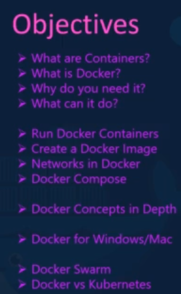
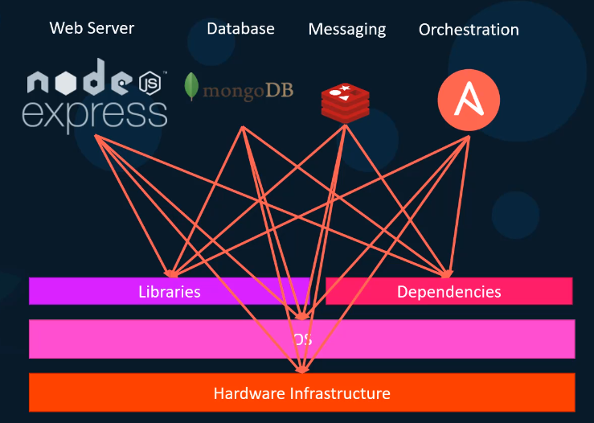
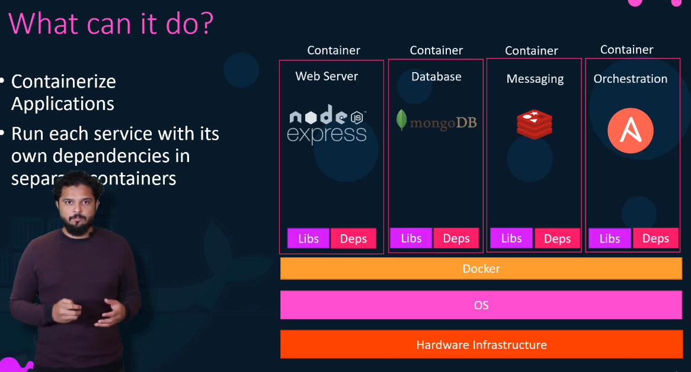
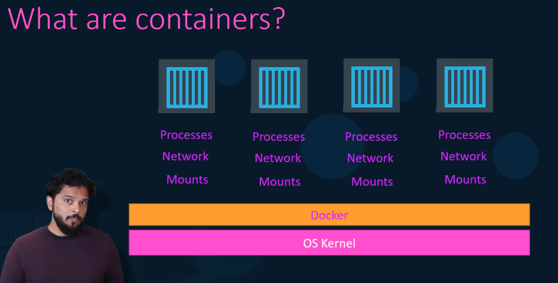
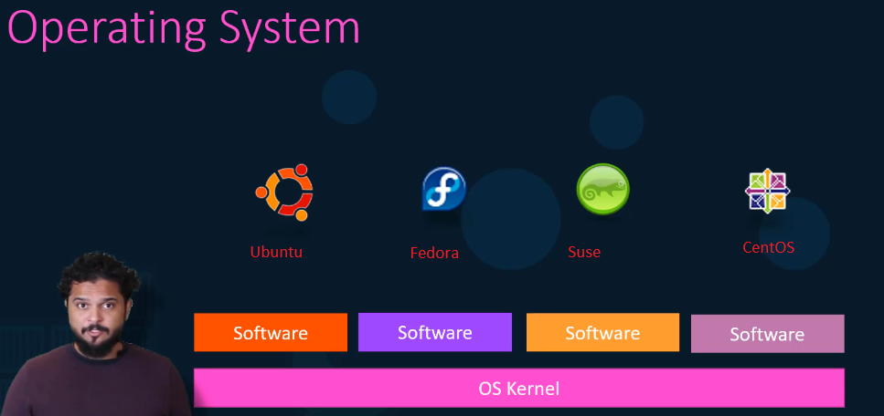
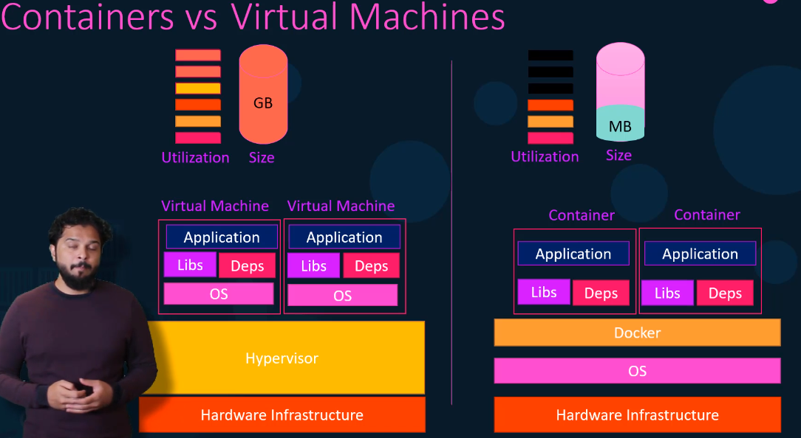
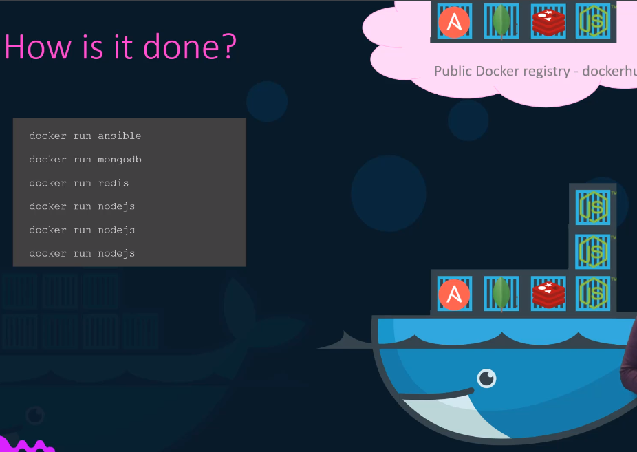
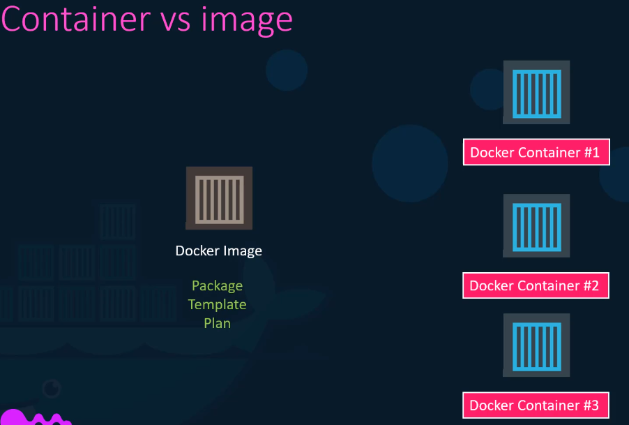

 Top

---

- ### [Introduction](#Introduction)
- ### [Docker Overview](#Docker_Overview)

---

## Introduction

In this course we first try to understand what containers are what docker is and why you might need it and what it can do for you.

- We will see how to run a docker container

- How to Build Your Own Docker image.

- We will see networking in Docker and how to use Docker compose

- What Docker registry is and how to deploy your own private registry

> ### We then look at some of these concepts in depth and we try to understand how a docker really works under the hood.

- We look at Docker for Windows and Mac

- Finally, getting a basic introduction to container orchestration tools like Docker Swarm and Kubernetes.

---

- [Top](#Back_To_Top)

---

## Docker Overview

Lets say we're developing this application stack

### Problems when working without Docker

- We had a lot of issues developing this application stack with all these different components. First of all their compatibility with the underlying OS was an issue we had to ensure that all these different services were compatible with the version of OS we were planning to use. There have been times when certain version of these services were not compatible with the OS and we have had to go back and look at different OS that was compatible with all of these different services. Secondly we had to check the compatibility between these services and the libraries and dependencies on the OS.

- Secondly we had to check the compatibility between these services and the libraries and dependencies on the OS. We've had issues where one service requires one version of a dependent library whereas another service requires another version. The architecture of our application changed over time.

- We've had to upgrade to newer versions of these components or change the database etc. And every time something changed we had to go through the same process of checking compatibility between these various components and the underlying infrastructure.

- Every time we had a new developer on board we found it really difficult to set up a new environment. The new developers had to follow a large set of instructions and run hundreds of commands to finally set up their environment. We had to make sure they were using the right operating system the right versions of each of these components and each developer had to set all that up by himself.

---

> ### All of this made our life in developing building and shipping the application really difficult. So I needed something that could help us with the compatibility issue and something that will allow us to modify or change these components without affecting the other components and even modify the underlying operating systems as required.

---

### Solution: Docker

And that search landed me on Docker. With Docker I was able to run each component in a separate container with its own dependencies and its own libraries all on the same VM and the OS but within separate environments or containers we just had to build the docker configuration once and all our developers could now get started with a simple `Docker run` command irrespective of what the underlying operating system they run.

---

#### So what are containers?

Containers are completely isolated environments. As in they can have their own processes or services their own network interfaces their own mounts just like virtual machines except they all share the same OS kernel.

It's also important to note that containers are not new with Docker containers have existed for about 10 years now and some of the different types of containers are LXC, LXD, LXCFS etc.

Docker utilizes LXC containers setting up these container environments is hard as they are very low level and that is where Docker offers a high level tool with several powerful functionalities making it really easy for end users like us to understand how Docker works.

---

Lets take a look at operating systems and Docker

If you look at operating systems like Ubuntu, Fedora, Suse or Centos – they all consist of two things an OS kernel and a set of software. The OS kernel is responsible for interacting with the underlying hardware while the OS kernel remains the same which is Linux. In this case it's the software above it that makes these operating systems different. This software may consist of a different user interface drivers compilers file managers developer tools etc. So you have a common Linux kernel shared across all OSes and some custom software that differentiate operating systems from each other.

> ### So you have a common Linux kernel shared across all OSes and some custom software that differentiate the operating systems from each other.

#### So what does it mean to share a common kernel?

Let's say we have a system with an Ubuntu OS with Docker installed on it. Docker can run any flavour of OS on top of it as long as they are all based on the same kernel. In this case Linux. If the underlying OS is Ubuntu Docker can run a container based on another distribution like Debian fedora, suse or centos.

Each docker container only has the additional software that we just talked about in the previous slide that makes these operating systems different and docker utilizes the underlying kernel of the docker host which works with all Oses above.

So what is an OS which does not share this kernel? **_Windows_**

So you won't be able to run a Windows based container on a docker host with Linux on it for that you will require Docker on a Windows server.

> ### When you install Docker on windows and run a Linux container on windows you're not really running a Linux container on Windows. Windows runs a Linux container on a Linux virtual machine under the hoods so it's really Linux container. The main purpose of Docker is to package and containerized applications and to ship them and to run them anywhere any times as many times as you want so that brings us to the differences between virtual machines and containers.

---

In case of Docker we have the underlying hardware infrastructure and then the OS and then Docker installed on the OS docker then manages the containers that run with libraries and dependencies along in case of virtual machines. We have the hypervisor like EXS on the hardware and then the virtual machines on them. As you can see each virtual machine has its own OS inside it. Then the dependencies and then the application the overhead causes higher utilization of underlying resources as there are multiple virtual operating systems and kernel running. The virtual machines also consume higher diskspace as each VM is heavy and is usually in gigabytes in size whereas docker containers are lightweight and are usually in megabytes in size.

---

#### Advantages of Docker over VMs

- This allows Docker cantainers to boot up faster usually in a matter of seconds whereas VMs as we know takes minutes to boot up as it needs to boot up the entire operating system.

- It is also important to note that Docker has less isolation as more resources are shared between the containers like the kernel whereas VMS have complete isolation from each other since VMS don't rely on the underlying OS or kernel. You can run different types of applications built on different OSes such as Linux based or Windows based apps on the same hypervisor.

> ### Now having said that it's not an either container or virtual machine situation. It's containers and virtual machines. Now when you have large environments with thousands of application containers running on thousands of docker hosts you will often see containers provisioned on virtual docker hosts. That way we can utilize the advantages of both technologies we can use the benefits of virtualization to easily provision or decommission docker hosts as required at the same time make use of the benefits of Docker to easily provision applications and quickly scale them as required.

---

#### So how is it done?

There are lots of containerized versions of applications readily available. So most organisations have their products containerized and available in a public dock or a repository called dock or hub or dock or store. For example you can find images of most common operating systems databases and other services and tools.

Once you identify the images you need and you install Docker on your host bringing up an application is as easy as running a duck or run command with the name of the image.

In this case running a docker run nodejs will run an instance of NodeJS on the dock or host.

If you need to run multiple instances of the web service simply add as many instances as you need and configure a load balancer of some kind.

---

#### Difference between images and containers

We've been talking about images and containers. Let's understand the difference between the two.

- An image is a package or a template just like a VM template that you might have worked with in the virtualization world. It is used to create one or more containers.

- Containers are running instances of images that are isolated and have their own environments and set of processes as we have seen before.

> ### A lot of products have been arrived already but in case you cannot find what you're looking for you could create your own image and push it to Docker Hub Repository making it available to the public.

---

#### The old way vs using Docker

Traditionally developers developed applications. Then they handed over to ops team to deploy and manage it in production environments. They do that by providing a set of instructions such as information about how the host must be set up. What prerequisites are to be installed on the host and how the dependencies are to be configured etc.. Since the ops team did not really develop the application on their own they struggle with setting it up when they hit an issue. They work with the developers to resolve it.

> ### With **_Docker_** to developers and operations teams work hand-in-hand to transform the guide into a docker file with both of their requirements. This Docker file is then used to create an image for their applications. This image can now run on any host with Docker installed on it and is guaranteed to run the same way everywhere.

So the ops team can now simply use the image to deploy the application since the image was already working when the developer built it and operations are have not modified it. It continues to work the same way when deployed in production and that's one example of how Docker contributes to the dev ops culture.

---

- [Top](#Back_To_Top)

---

- ### [Working with Props and Types for Props](#Working_with_Props_and_Types_for_Props)

## Working with Props and Types for Props

---

- [Top](#Back_To_Top)

---

- ### [Getting User Input with "refs"](#Getting_User_Input_with_"refs")

## Getting User Input with "refs"

---

- [Top](#Back_To_Top)

---

- ### [Cross-Component Communication](#Cross-Component_Communication)

## Cross-Component Communication

---

- [Top](#Back_To_Top)

---

- ### [Working with State and Types](#Working_with_State_and_Types)

## Working with State and Types

---

- [Top](#Back_To_Top)

---

- ### [Managing State better](#Managing_State_better)

## Managing State better

---

- [Top](#Back_To_Top)

---

---

- ### [More Props & State Work](#More_Props_&_State_Work)

## More Props & State Work

---

- [Top](#Back_To_Top)

---

- ### [Adding Styling](#Adding_Styling)

## Adding Styling

---

- [Top](#Back_To_Top)

---

- ### [Types for other React Features (Redux or Routing)](<#Types_for_other_React_Features_(Redux_or_Routing)>)

## Types for other React Features (Redux or Routing)

- ### [Top](#Back_To_Top)
